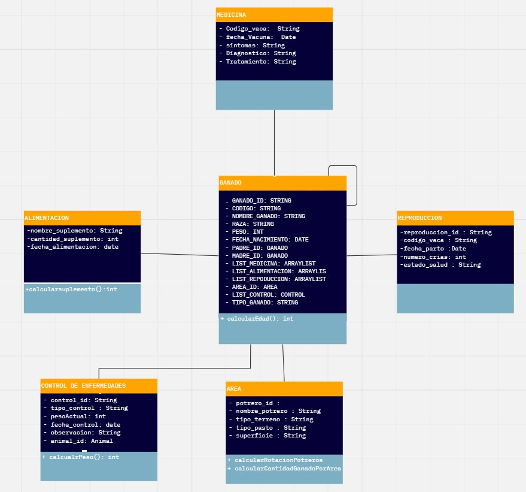

# Proyecto de sistema de crianza de ganaderia
<description>
Integrantes
- Wilmer Shagñay
- Mercy Arrobo
- Johanna Salazar
<p>
El proyecto consiste en un sistema de crianza de ganado, el cual permite llevar un control de los animales, medicinas, alimentacion, reproduccion, control de enfermedades y el area de crianza.
</p>
</description>

### Tecnologias
<a href="https://www.typescriptlang.org/" title="Typescript"></a>
<a href="https://developer.mozilla.org/en-US/docs/Web/JavaScript" title="JavaScript"></a>
<a href="https://angular.io/" title="Angular"></a>
<a href="https://www.java.com/" title="Java"></a>
<a href="https://nodejs.org/" title="Node.js"></a>
<a href="https://getbootstrap.com/" title="Bootstrap"></a>
<a href="https://www.w3.org/TR/html5/" title="HTML5"></a>
<a href="https://www.w3.org/TR/CSS/" title="CSS3"></a>
<a href="https://spring.io/" title="Spring"></a>
<a href="https://www.docker.com/" title="docker"></a>
<a href="https://git-scm.com/" title="Git"></a>

## Backend 
- Sprint boot 
## Frontend
- Angular
## Maquina virtual 
- Docker

## Clases
- Ganado
- Medicina
- AlimentacionModel
- Reproduccion
- Control de enfermedades
- Area de crianza

## Diagrama de clases
  

## Diagrama de secuencia
 

## Comandos para ejecutar docker
### Crear imagen
```
docker build -t ganaderia .
```
### Crear contenedor
```
docker run -d -p 8080:8080 ganaderia
```
### Ver contenedores
```
docker ps
```
### Eliminar contenedor
```
docker rm -f <id_contenedor>
```
### Eliminar imagen
```
docker rmi -f <id_imagen>
```
### Ver logs
```
docker logs <id_contenedor>
```
### Ver imagenes
```
docker images
```
### Ver contenedores
```
docker ps
```
### Ver contenedores detenidos
```
docker ps -a
```
###  Para correr el docker compose
```
docker-compose up
```
### Para correr el docker compose en segundo plano
```
docker-compose up -d
```
### Para parar el docker compose
```
docker-compose down
```
### Para parar el docker compose y eliminar los contenedores
```
docker-compose down --rmi all
```
### Para parar el docker compose y eliminar los contenedores y las imagenes
```
docker-compose down --rmi all --volumes
```
### Para parar el docker compose y eliminar los contenedores y las imagenes y las redes
```
docker-compose down --rmi all --volumes --remove-orphans
```
### Para parar el docker compose y eliminar los contenedores y las imagenes y las redes y los volumenes
```
docker-compose down --rmi all --volumes --remove-orphans --volumes
```
### Para parar el docker compose y eliminar los contenedores y las imagenes y las redes y los volumenes y los orfanos
```
docker-compose down --rmi all --volumes --remove-orphans --volumes --remove-orphans
```
### Para parar el docker compose y eliminar los contenedores y las imagenes y las redes y los volumenes todos los orfanos
```
docker-compose down --rmi all --volumes --remove-orphans --volumes --remove-orphans --rmi all
```
## Comandos para ejecutar angular
### Para instalar angular
```
npm install -g @angular/cli
```
### Para crear un proyecto de angular
```
ng new <nombre_proyecto>
```
### Para crear un proyecto de angular sin repositorio de git
```
ng new <nombre_proyecto> --skip-git
```
### Crear un componente
```
ng generate component <nombre_componente>
```
### Crear un servicio
```
ng generate service <nombre_servicio>
```
### Crear un modulo
```
ng generate module <nombre_modulo>
```
### Crear un modulo de rutas
```
ng generate module app-routing --flat --module=app
```
### Crear un modulo de rutas con un prefijo
```
ng generate module app-routing --flat --module=app --routingPrefix=app
```
### Para correr el proyecto de angular y se abra en el navegador
```
ng serve -o
```
### Para correr el proyecto de angular en un puerto especifico
```
ng serve --port <numero_puerto>
```
### Para correr el proyecto de angular en un puerto especifico y se abra en el navegador
```
ng serve --port <numero_puerto> -o
```

## Comandos de git
### Para inicializar un repositorio de git
```
git init
```
### Para agregar todos los archivos al repositorio de git
```
git add .
```
### Realizar un commit con un mensaje
```
git commit -m "mensaje"
```
### Crear la rama master
```
git branch -M master
```
### Iniciar sesion en git
```
git config --global user.email "email"
git config --global user.name "nombre"
```
### Para ver los repositorios remotos
```
git remote -v
```
### Para agregar un repositorio remoto
```
git remote add origin <url_repositorio>
```
### Para subir los cambios al repositorio remoto
```
git push -u origin master
```
### Para clonar un repositorio
```
git clone <url_repositorio>
```
### Para clonar un rama especifica de un repositorio
```
git clone -b <nombre_rama> <url_repositorio>
```
### Para ver el estado de los archivos
```
git status
```
### Para ver el historial de los commits
```
git log
```
### Para ver el historial de los commits de una forma mas resumida
```
git log --oneline
```
### Enviar cambios al repositorio remoto
```
git push
```
### Para ver las ramas
```
git branch
```
### Para crear una rama
```
git branch <nombre_rama>
```
### Para cambiar de rama
```
git checkout <nombre_rama>
```
### Para crear una rama y cambiar a esa rama
```
git checkout -b <nombre_rama>
```
